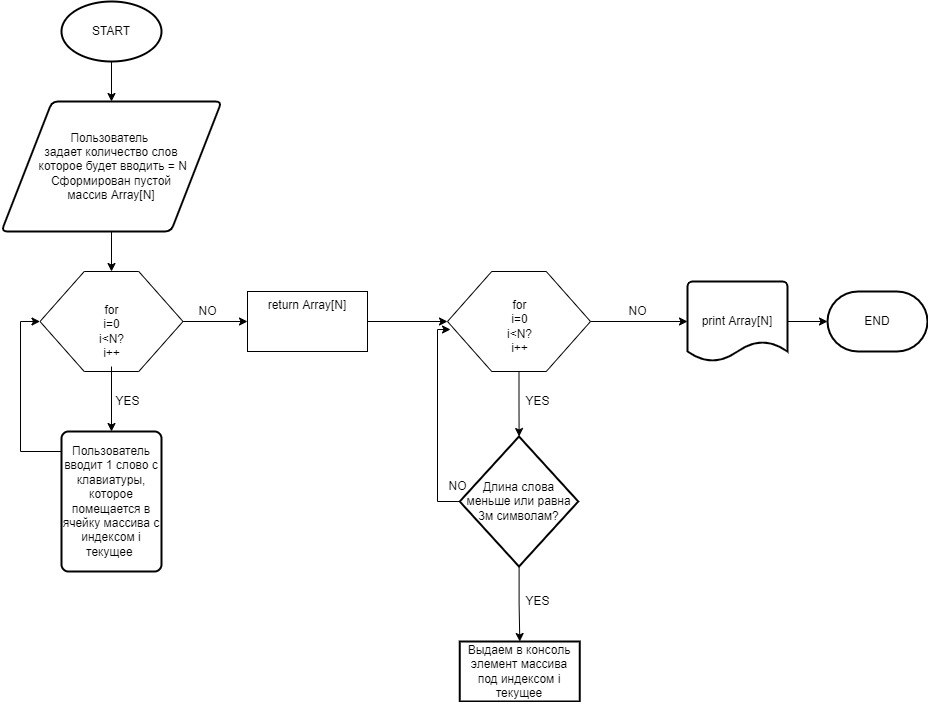

# Техническое описание программы 
### Созданная мной программа осуществляет свою работу по следующему алгоритму:

 
### Принцип работы с точки зрения пользователя:
- В данной программе пользователю предлагается сначала задать, 
кол-во слов которое он в дальнейшем будет вводить, а затем через Enter он воодит слова в соответствии с данным колличеством.
### Принцип работы с технической точки зрения:
1) В первую очередь создаеться массив с кол-вом элементов заданым
пользователем типа string. 
2) В методе Array формируеться массив в ячейки которого записываються
данные вводимые пользователем под соответсвующими индексам.
3) В методе ShowArray происходит печать полученного массива 
одновременно с отсеиванием элементов больше 3х элементов.
4) Произодиться вызов методов и работа программы.
